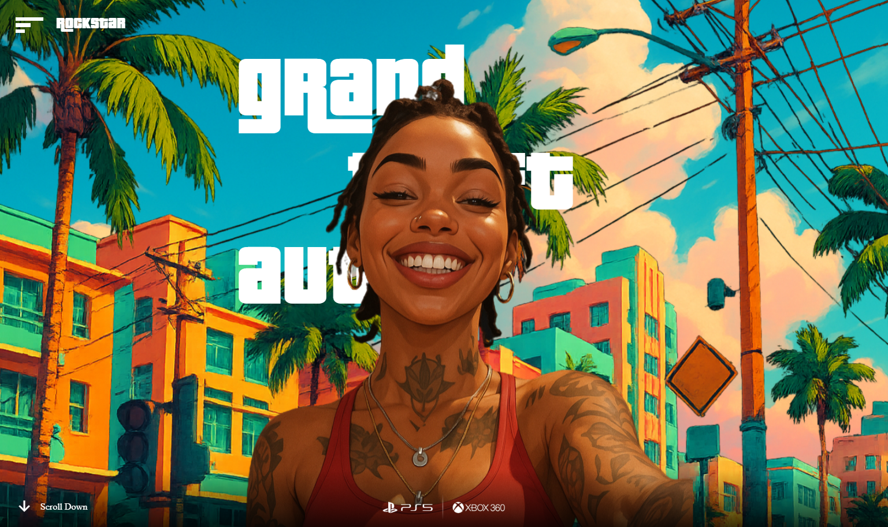

# 🎮 GTA VI Inspired Interactive Landing Page

Welcome to my **GTA VI-inspired React landing experience** — a fully animated, cinematic showcase created using React, GSAP, and modern frontend design techniques. This project captures the energy and boldness of Rockstar’s iconic visuals, reimagined in a purely frontend-driven digital art piece.

---

## 💡 What is this?

This isn't just a landing page — it's a storytelling experiment.  
From the immersive "VI" SVG intro mask reveal, to dynamic parallax-driven backgrounds, layered text, and a moving character, each interaction is designed to create a feeling of entering a game world.

I wanted to explore how micro-interactions, timeline animations, and layered motion can evoke excitement even before the user touches the actual game.  

---

## 🛠️ Tech Stack

- **React.js** for component-based architecture and state handling.
- **GSAP (GreenSock Animation Platform)** for powerful timeline animations and smooth transitions.
- **Remix Icons** for crisp, scalable UI icons.
- Pure CSS and Tailwind classes for responsive design and typography.

---

## ✨ Key Features

- **SVG Mask Intro Animation**: A "VI" mask reveal that scales and fades, creating a cinematic entrance.
- **Layered Parallax Scenes**: Sky, background, text, and character layers move independently based on cursor, creating depth.
- **Dynamic Character Animation**: The iconic character element slides and scales into place.
- **Interactive Text Reveal**: Large "grand theft auto" text dynamically moves on cursor hover.
- **Engaging Call-to-Action**: "Download Now" button with bold styling to mimic game promo sites.
- **Responsive & Fluid**: Works seamlessly on large screens; animation transitions scale down gracefully.

---

## 🚀 Live Demo

Check out the full experience here:  
[🔗 View Live Demo](https://your-live-demo-link.com)

---

## 📸 Screenshots

---

## 🧩 How It Works

- **App.jsx**:  
  - Handles the entire animation logic using GSAP timelines.
  - `useGSAP()` hooks control both intro SVG mask and main scene animations.
  - Mouse move events power parallax shifts across different image layers.

- **main.jsx**:  
  - Simple root render logic with React StrictMode.

- **index.html**:  
  - Purely serves as root container; minimal boilerplate for clean bootstrapping.

---

## 💬 Why I Built This

I love merging design and frontend technology to craft experiences that feel alive and immersive. Inspired by Rockstar's iconic visual style and cinematic game intros, I set out to create something that would push my creative coding and animation skills further — using only React and GSAP without any heavy 3D engines.

---

---

## 🚀 How to Run

1️⃣ Clone this repository:

git clone https://github.com/yourusername/gta-vi-react-landing.git

2️⃣ Install dependencies:

npm install

3️⃣ Start the local development server:

npm run dev

⭐️ If you enjoy this project, please give it a star! Your support motivates me to keep creating bold and creative experiences.

